# 2.CRYPTOGRAPHY

Cryptography is a deep academic research field using many advanced mathematical techniques that are notoriously subtle and complicated. Fortunately, Bitcoin relies on only a handful of relatively simple and well-known cryptographic constructions. In this section, we specifically study cryptographic hashes and digital signatures, two primitives that prove to be useful for building cryptocurrencies.

## 2.1-Cryptographic Hash Functions

In this section, we’ve talked about hash functions, cryptographic hash functions with special properties, applications of those properties, and a specific hash function that we use in Bitcoin. The first cryptographic primitive that we need to understand is a cryptographic hash function. A hash function is a mathematical function with the following three properties:

- Its input can be any string of any size.
- It produces a fixed-sized output. For the purpose of making the discussion in this chapter concrete, we will assume a 256-bit output size. However, our discussion holds true for any output size, as long as it is sufficiently large.
- It is efficiently computable. Intuitively this means that for a given input string, you can figure out what the output of the hash function is in a reasonable amount of time. More technically, computing the hash of an n-bit string should have a running time that is *O*(*n*).

These properties define a general hash function, one that could be used to build a data structure, such as a hash table. We're going to focus exclusively on *cryptographic* hash functions. For a hash function to be cryptographically secure, we require that it has the following three additional properties:
(1) collision resistance, (2) hiding, and (3) puzzle friendliness.

### Property 1: Collision Resistance

The first property that we need from a cryptographic hash function is
that it's collision‐resistant. A collision occurs when two distinct
inputs produce the same output. A hash function *H(.)* is
collision‐resistant if nobody can find a collision.

Formally:

> **Collision‐resistance:** A hash function *H* is said to be collision resistant if it is infeasible to find two values, ***x*** and ***y***, such that \[***x ≠ y***\]*,* yet \[***H(x) = H(y)***\].

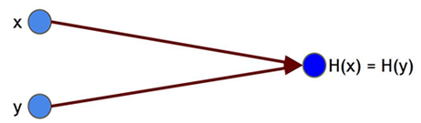

Figure 1 - A hash collision. x and y are distinct values, yet when input into hash function H, they produce the same output.

Notice that we said “nobody can find” a collision, but we did not say that no collisions exist. Actually, collisions exist for any hash function, and we can prove this by a simple counting argument. The input space to the hash function contains all strings of all lengths, yet the output space contains only strings of a specific fixed length. Because the input space is larger than the output space (indeed, the input space is infinite, while the output space is finite), there must be input strings that map to the same output string. In fact, there will be some outputs to which an infinite number of possible inputs will map.

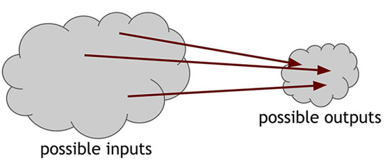

Figure 2 - Inevitability of collisions. Because the number of inputs exceeds the number of outputs, we are guaranteed that there must be at least one output to which the hash function maps more than one input.

Now, to make things even worse, we said that it has to be impossible to find a collision. Yet, there are methods that are guaranteed to find a collision. Consider the following simple method for finding a collision for a hash function with a 256‐bit output size: pick $2^{256} + 1$ distinct values, compute the hashes of each of them, and check if there are any two outputs are equal. Since we picked more inputs than possible outputs, some pair of them must collide when you apply the hash function.[^1]

The method above is guaranteed to find a collision. But if we pick random inputs and compute the hash values, we'll find a collision with high probability long before examining $2^{256} + 1$ inputs. In fact, if we randomly choose just $2^{130} + 1$ inputs, it turns out there's a 99.8% chance that at least two of them are going to collide.[^2]

This collision-detection algorithm works for every hash function. But, of course, the problem is that it takes a very long time to do. For a hash function with a 256-bit output, you would have to compute the hash function $2^{256} + 1$ times in the worst case, and about $2^{128}$ times on average. That's of course an astronomically large number---if a computer calculates 10,000 hashes per second, it would take more than one octillion ($10^{27}$) years to calculate $2^{128}$ hashes! For another way of thinking about this, we can say that if every computer ever made by humanity had been computing since the beginning of the universe, the odds that they would have found a collision by now are still infinitesimally small. So small that it's far less than the odds that the Earth will be destroyed by a giant meteor in the next two seconds.

We have thus found a general but impractical algorithm to find a collision for *any* hash function. A more difficult question is: Is there some other method that could be used on a particular hash function to find a collision? In other words, although the generic collision detection algorithm is not feasible to use, there may be some other algorithm that can efficiently find a collision for a specific hash function.

Yet for other hash functions, we don't know if such methods exist. We suspect that they are collision resistant. However, there are no hash functions *proven* to be collision‐resistant. The cryptographic hash functions that we rely on in practice are just functions for which people have tried really, really hard to find collisions and haven't yet succeeded. In some cases, such as the old MD5 hash function, collisions were eventually found after years of work, leading the function to be deprecated and phased out of practical use. And so, we choose to believe that those are collision resistant.

#### Application: Message digests

If we can assume that we have a hash function that is Collision Resistance, then we can use that hash function as message digest. That means if we know that x and y have the same hash, then it\'s safe to assume that x and y are the same. Because of Collision Resistance Property, since there\'s not a collision that we know of, then knowing the hashes are the same, we can assume that the values are the same. And this let us use the hash as a kind of message digest. Suppose, for example, that we had a file, a really big file. And we wanted to be able to recognize later whether another file was the same as the file we saw the first time, right? So, one way to do that would be to save the whole big file. And then when we saw another file later, just compare them. But because we have hashes that we believe are collision free, it\'s more efficient to just remember the hash of the original file. Then if someone shows us a new file, and claims that it\'s the same, we can compute the hash of that new file and compare the hashes. If the hashes are the same, then we conclude that the files must have been the same. And that gives us a very efficient way to remember things we\'ve seen before and recognize them again. And, of course, this is useful because the hash is small, it\'s only 256 bits, while the original file might be really big. So, hash is useful as a message digest.

### Property 2: Hiding - Preimage resistance (one wayness)

The second property that we want from our hash functions is that it's hiding. The hiding property asserts that if we're given the output of the hash function y = H(x), there's no feasible way to figure out what the input, x, was.

In cases where the number of possible input (X) values is limited and specified (in fact it's predictable), the adversary can hash the possible inputs one by one and compare them with the desired output. Thus, he finds the input X that results in the output Y = H (X). So, in such cases, our hash function practically does not hide the input.

In order to be able to achieve the hiding property, it needs to be the case that there’s no value of x which is particularly likely. That is, x has to be chosen from a set that’s, in some sense, very spread out. If x is chosen from such a set, this method of trying a few values of x that are especially likely will not work. Also, we want method that we can hide even an input that’s not spread out.  We can now be slightly more precise about what we mean by hiding (the double vertical bar ‖ denotes concatenation).

> **Hiding:** A hash function H is hiding if: when a secret value *r* is chosen from a probability distribution that has *high min‐entropy,* then given H *(r* ‖ *x)* it is infeasible to find *x.*

High min-entropy means that the distribution is very spread out, and it\'s not predictable, so that no particular value is chosen with more than negligible probability. for a concrete example, if r is chosen uniformly from among all of the strings that are 256 bits long, then any particular string was chosen with probability $\frac{1}{2^{256}}$, which is an infinitesimally small value. So, as long as r was chosen that way, then the hash of r concatenated with x is going to hide x. And that\'s the hiding property that the hash function will be deemed to have.

> r: A random and hidden value that is called "Key" or "Nonce" in cryptography. The term "Nonce" refers to the fact that its value is used only once. And Each time the hash function is called, in order to hide the input (X), it is combined with a new random value and then hashed.

#### Application

Let's look at the applications of "collision resistance" and "hiding" by an example. Suppose we write a message on a letter and put it in a sealed envelope. In this example, the message is like X, and the envelope plays the hash function role, and the usage of nonce, is likened to sealing. Suppose we put this message (X) in a sealed (combination of X and nonce) envelope (to hash) and put it on a table in front of everyone. Now, no one but us, who have sealed it (we know the message and nonce), can find out the message (X value) by looking at the envelope (hash function output). So, the message remains a secret from everyone else, which states **"hiding"** property.
Also, obviously, after sealing the envelope, even if we change our mind, we cannot change the message already written in the envelope or replace it with another message (it is infeasible to find any two messages, one to replace by each other, which after combining with nonce, and get hashing, has brought us to the same output). Which states **"collision‐resistance"** property.

### Property 3: Puzzle Friendliness - Target Collision Resistance

This property is more complicated. If somebody expects a certain output (like Y) from the hash function and consider it as the purpose, and if a part of the input is chosen from satisfying randomness. Then, it is infeasible to find another input that results considered purpose (Y).

> **Puzzle friendliness:** A hash function *H* is said to be puzzle friendly if for every possible *n*-bit output value *y*, if *k* is chosen from a distribution with high min-entropy, then it is infeasible to find *x* such that *H*(*k* ‖ *x*) = *y* in time significantly less than $2^{n}$.

A good puzzle shouldn't have to be solved fast. And there is no shortcut to solve the puzzle, but randomly looking for pieces one by one, to find the right piece. As the same way, for an appropriate hash function, it should be time and energy consuming to check inputs to find the one which reaches the certain output. Also, no other shortcut strategy or algorithm can be found that is more efficient than randomly checking each input. As a result, in the situation that the number of inputs is very large, it is practically impossible to find the input X that results in a certain output Y.

About the relation between Property 1 (Collision Resistance) and Property 3 (Puzzle Friendliness), It can be said that: If the first property is hold by a hash function, then the third property is also true. Note that the third property is different from the first property. For the considered certain input and output (such as x and h (x)), to be able to find another input(x') whose hash is h (x') = h (x), is enough to break the third property. While the first property states that the hash function should be such that practically no random pairs of input and output can be found where the inputs are different but the function results the same output.

Consider a hash function with n-bit output (which can take any of 2^n values). Solving the puzzle requires finding an input so that the output falls within the set Y (can be selected and considered), which is typically much smaller than the set of all outputs. The size of Y determines how hard the puzzle is. If Y is the set of all n‐bit strings (it means all outputs are acceptable) the puzzle is trivial, whereas if Y has only 1 element (it means only one output is acceptable) the puzzle is maximally hard. The application of this concept and the idea to have a sort of computational puzzle which gives the ability to determine the difficulty of the puzzle, plays an important role in "mining" that we will talk about later.

### SHA-256

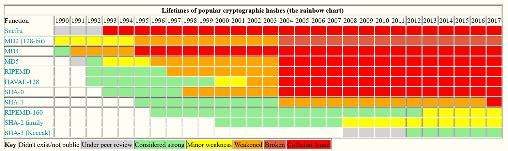

Figure 3 - Lifetimes and states of most common cryptographic hash algorithms. 1990-2017

Many hash functions exist, but this is the one Bitcoin uses primarily, and it's a pretty good one to use. It's called SHA-256 from SHA-2 family. Recall that we require that our hash functions work on inputs of arbitrary length. Luckily, as long as we can build a hash function that works on fixed‐length inputs, there's a generic method to convert it into a hash function that works on arbitrary length inputs. It's called the ***Merkle‐Damgard transform***. SHA‐256 is one of a number of commonly used hash functions that make use of this method. In common terminology, the underlying fixed‐length collision‐resistant hash function is called the ***compression function***. It has been proven that if the underlying compression function is collision resistant, then the overall hash function is collision resistant as well.

The Merkle‐Damgard transform is quite simple. Say the compression function takes inputs of length *m* and produces an output of a smaller length *n.* The input to the hash function, which can be of any size, is divided into ***blocks*** of length *m‐n.* The construction works as follows: pass each block together with the output of the previous block into the compression function. Notice that input length will then be *(m‐n) + n = m*, which is the input length to the compression function. For the first block, to which there is no previous block output, we instead use an ***Initialization Vector (IV)***. This number is reused for every call to the hash function, and in practice you can just look it up in a standards document. The last block's output is the result that you return.

SHA‐256 uses a compression function that takes 768‐bit input and produces 256‐bit outputs. The block size is 512 bits. See Figure 4 for a graphical depiction of how SHA‐256 works.

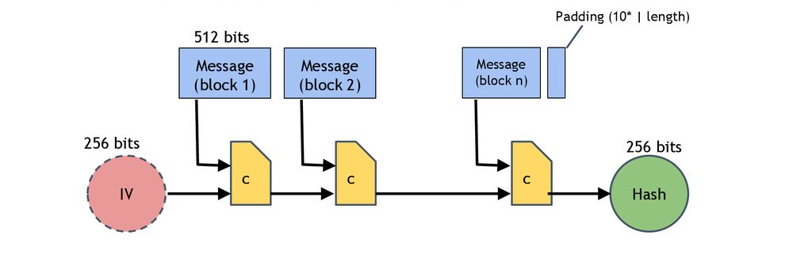

Figure 4 - SHA‐256 Hash Function (simplified). SHA‐256 uses the Merkle‐Damgard transform to turn a fixed length collision‐resistant compression function into a hash function that accepts arbitrary‐length inputs. The input is "padded" so that its length is a multiple of 512 bits.

#### Compression Function - One-Way Function

**one-way compression function** is a function that transforms and mixestwo fixed length inputs and produces a single fixed length output of the same size as one of the inputs. This can also be seen as that the compression function transforms one large fixed-length input into a shorter, fixed-length output. The transformation is "one-way", meaning that it is difficult given a particular output to compute inputs which compress to that output. One-way compression functions are not related to conventional data compression algorithms, which instead can be inverted exactly (lossless compression) or approximately (lossy compression) to the original data.
The mixing is done in such a way that full "avalanche effect[^3]" is achieved.

#### Initialization Vector (IV), (Initial Hash Value)

Initialization Vector (IV), is a 256-bit value, as the initial hash value for SHA-256 hash function. "IV" with the first 512-bit block of message, are inputs of the first compression function. "IV", as a constant value, consists of eight 32-bit word, which are reused for every call to the SHA-256 hash function. figure below shows "IV" value in Hexadecimal-representation.

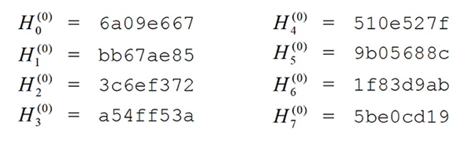

Figure 5  - "Initialization Vector", a constant value, consist of eight 32-bit word (in Hex). Recorded in SHA-256 standard.

These words were obtained by taking the first thirty-two bits of the fractional parts of the square roots of the first eight prime numbers.

#### Merkle--Damgard Strengthening & Padding

In order to make the construction secure, Merkle and Damgard proposed that messages be padded with a padding that encodes the length of the original message. This is called *length padding* or *Merkle--Damgard strengthening*.

The message isn\'t going to be, in general, necessarily exactly a
multiple of the block size, so we\'re going to add some padding at the
end of last block. And the padding is going to consist of, a 64-bit
length field at the end of the padding, which is the length of the
message in bits(binary). And then before that, a one bit, followed by
some number of zero bits.

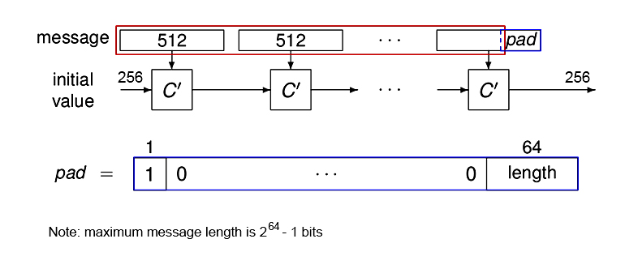

Figure 6 - Merkle-Damgard Strengthening & Padding to SHA-256 algorithm.

First, the message is padded with a binary '1' then it is cut into blocks of 512 bits. If the length of the last block does not exceed 448 bits, as many zeros as necessary are appended to fill 448 bits and the binary length of the original message (before padding) is appended in the last 64 bits of the block to form a 512bit block. Else, the block is filled with zeros up to a length of 512 bits, and an extra block is appended filled with 448 zeros; again, the binary length of the original message is appended in the last 64 bits to form a complete 512-bit block. So, once you\'ve padded the message such that, its length is exactly a multiple of the 512-bit block size. This form of padding is non-ambiguous and is an example of a valid Merkle-Damgard strengthening.

padding is always done, even if the message happens to be a multiple of the input block size. If padding is not always done, there is an easy hash collision, a message will have the same hash as that message with the pad appended.

---

## 2.2-HASH POINTERS AND DATA STRUCTURES

In this section, we'll discuss ways of using hash functions to build more complicated data structures that are used in distributed systems like Bitcoin. we're going to discuss ***hash pointers*** and their applications.

### Hash pointer

A hash pointer is a data structure that is simply a pointer to where some information is stored together with a cryptographic hash of the value of that data at some fixed point in time. Whereas a regular pointer gives you a way to retrieve the information, a hash pointer also gives you a way to verify that the information hasn't changed.

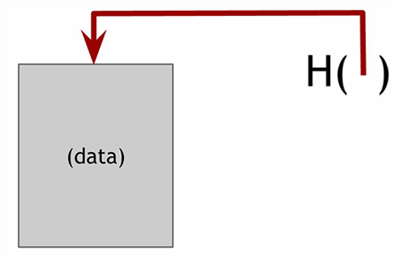

Figure 7 - A hash pointer.

### Block chain

In Figure below, we built a linked list using hash pointers. We're going to call this data structure a ***blockchain.*** in a block chain, each block has data as well as a hash pointer to the previous block. So, each block not only tells us where the value of the previous block was, but it also contains a digest of that value that allows us to verify that the value hasn't changed. We store the head of the list, which is just a regular hash‐pointer that points to the most recent data block.

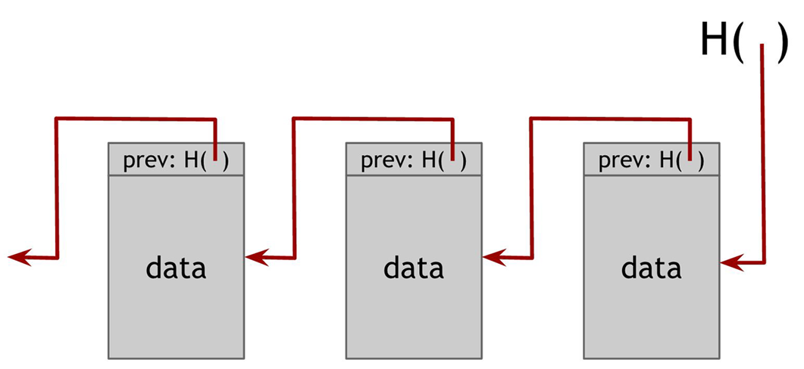
Figure 8 - A block chain is a linked list that is built with blocks of data and hash pointers

#### Application: tamper‐evident log

A use case for a block chain is a tamper‐evident log. That is, we want to build a log data structure that stores a bunch of data, and allows us to append data onto the end of the log. But if somebody alters data that is earlier in the log, we're going to detect it.

To understand why a block chain achieves this tamper‐evident property, let’s ask what happens if an adversary wants to tamper with data that’s in the middle of the chain. the adversary changes the data of some block k. Since the data has been changed, the hash in block k + 1, which is a hash of the entire block k, is not going to match up. Remember that we are statistically guaranteed that the new hash will not match the altered content since the hash function is collision resistant. And so, we will detect the inconsistency between the new data in block k and the hash pointer in block k + 1. the adversary can continue to try and cover up this change by changing the next block’s hash as well. but this strategy will fail when he reaches the head of the list, and because he won’t be able to tamper with that, as long as we store the hash pointer at the head of the list. Thus, by just remembering this single hash pointer, we’ve essentially remembered a tamper‐evident hash of the entire list. and the adversary will be unable to change any block without being detected. So, we can build a block chain like this containing as many blocks as we want.

Figure 9 - Tamper‐evident log. If an adversary modifies data anywhere in the block chain, it will result in the hash pointer in the following block being incorrect. If we store the head of the list, then even if the adversary modifies all of the pointers to be consistent with the modified data, the head pointer will be incorrect, and we will detect the tampering.

### Merkle tree

Another useful data structure that we can build using hash pointers is a binary tree. A binary tree with hash pointers is known as a ***Merkle tree***, after its inventor Ralph Merkle. Suppose we have a number of blocks containing data. These blocks comprise the leaves of our tree. We group these data blocks into pairs of two, and then for each pair, we build a data structure that has two hash pointers, one to each of these blocks. These data structures make the next level up of the tree. We in turn group these into groups of two, and for each pair, create a new data structure that contains the hash of each. We continue doing this until we reach a single block, the root of the tree.

As before, we remember just the hash pointer at the head of the tree. We now have the ability to follow paths through the hash pointers to any point in the list. This allows us make sure that the data hasn’t been tampered with because, just like we saw with the block chain, if an adversary tampers with some data block at the bottom of the tree, that will cause the hash pointer that’s one level up to not match, and even if he continues to tamper with this block, the change will eventually propagate to the top of the tree where he won’t be able to tamper with the hash pointer that we’ve stored. So again, any attempt to tamper with any piece of data will be detected by just remembering the hash pointer at the top.

Figure 10 - **Merkle tree.** In a Merkle tree, data blocks are grouped in pairs and the hash of each of these blocks is stored in a parent node. The parent nodes are in turn grouped in pairs and their hashes stored one level up the tree. This continues all the way up the tree until we reach the root node.

#### Application1: proof of membership

Another nice feature of Merkle trees is that, unlike the block chain that we built before, it allows a concise proof of membership. Say that someone wants to prove that a certain data block is a member of the Merkle Tree. As usual, we remember just the root. Then they need to show us this data block, and the blocks on the path from the data block to the root. We can ignore the rest of the tree, as the blocks on this path are enough to allow us to verify the hashes all the way up to the root of the tree.
See Figure below for a graphical depiction of how proof of membership in Merkle Tree works.

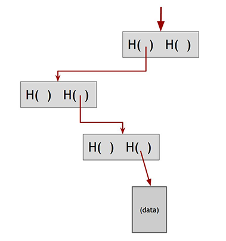

Figure 11 - Proof of membership. To prove that a data block is included in the tree, one only needs to show the blocks in the path from that data block to the root.

If there are *n* nodes in the tree, only about *log(n)* items need to be shown. And since each step just requires computing the hash of the child block, it takes about *log(n)* time for us to verify it. And so even if the Merkle tree contains a very large number of blocks, we can still prove membership in a relatively short time. Verification thus runs in time and space that's logarithmic in the number of nodes in the tree.

while, in the blockchain data structure, in order to check the membership of a certain data in the blocks, we need to have: other complementary data of same block, all the data from later blocks, and at least hash-pointer of the previous block. Also, all the calculation on the blocks most be repeated. if we concluded the hash-pointer of the latest block, as same as the hash-pointer that we stored before, then we find the proof of membership.

#### Application2: proof of non‐membership - Variant: sorted Merkle tree

A ***sorted Merkle tree*** is just a Merkle tree where we take the blocks at the bottom, and we sort them using some ordering function. This can be alphabetical, lexicographical order, numerical order, or some other agreed upon ordering.

With a sorted Merkle tree, it becomes possible to verify non‐membership in a logarithmic time and space. That is, we can prove that a particular block is not in the Merkle tree. And the way we do that is simply by showing a path to the item that's just before where the item in question would be and showing the path to the item that is just after where it would be. If these two items are consecutive in the tree, then this serves as a proof that the item in question is not included. For if it was included, it would need to be between the two items shown, but there is no space between them as they are consecutive.

---

## 2.3-DIGITAL SIGNATURES

In this section, we'll look at ***digital signatures.*** This is the second cryptographic primitive, along with hash functions. A digital signature is an electronic analogue of a written signature. We desire two properties from digital signatures, Firstly, the digital signature can be used to provide assurance that the claimed signatory signed the information and only you can make your signature, but anyone who sees it can verify that it's valid. Secondly, a digital signature should be used to detect whether or not the information was modified after it was signed (i.e., to detect the integrity of the signed data). In other word, we want the signature to be tied to a particular document so that the signature cannot be used to indicate your agreement or endorsement of a different document. A properly implemented digital signature algorithm that meets the requirements of this Standard can provide these services.

### Digital signature scheme

A digital signature scheme consists of the following three algorithms:

- **keys generation: (sk, pk) := generatekeys( *keysize* )** The generatekeys method takes a key size and generates a key pair. The private key or secret key *sk* is kept privately and used to sign messages. *Pk* is the public verification key that you give to everybody. Anyone with this key can verify your signature.
- **Signature generation: sig := sign( *sk* , *message* )** The sign method takes a message and a secret key, *sk*, as input and outputs a signature for *message* under *sk.*
- **Signature verification:** **isvalid := verify( *pk* , *message* , *sig* )** The verify method takes a message, a signature, and a public key as input. It returns a boolean value, *isvalid,* that will be ***true*** if *sig* is a valid signature for *message* under public key *pk*, and ***false*** otherwise.

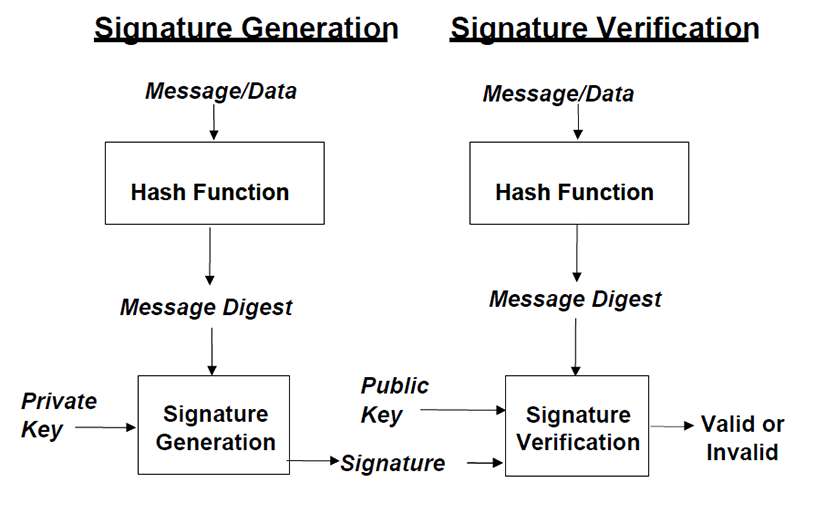

Figure 12 - Digital signature processes

A digital signature algorithm includes a signature generation process and a signature verification process. A signatory uses the generation process to generate a digital signature on data; a verifier uses the verification process to verify the authenticity of the signature. Each signatory has a public and private key and is the owner of that key pair. the private key is used in the signature generation process. The key pair owner is the only entity that is authorized to use the private key to generate digital signatures. In order to prevent other entities from using the private key to generate fraudulent signatures, the private key must remain secret. The approved digital signature algorithms are designed to prevent an adversary who does not know the signatory’s private key from generating the same signature as the signatory on a different message. The public key is used in the signature verification process. The public key need not be kept secret, anyone can verify a correctly signed message using the public key.

**keys generation (Generatekeys)** and **Signature generation (sign)** algorithms can be randomized algorithms. Indeed, generatekeys had better be randomized because it ought to be generating different keys for different people. **Signature verification**, on the other hand, will always be deterministic. For both the signature generation and verification processes, the message (i.e., the signed data) is converted to a fixed-length representation of the message by means of an approved hash function. Both the original message and the digital signature are made available to a verifier. A verifier also requires assurance that the key pair owner actually possesses the private key associated with the public key, and that the public key is a mathematically correct key.

Briefly, we require from these algorithms that the following two properties hold:

**1.Valid signatures must verify:** verify ( pk , message , sign ( sk , message )) == **true**

If I sign a message with sk , my secret key, and someone later tries to validate that signature over that same message using my public key, pk , the signature must validate correctly. This property is a basic requirement for signatures to be useful at all.

**2.Signatures are** **existentially unforgeable:**

The second requirement is that it's computationally infeasible to forge signatures. That is, an adversary who knows your public key and gets to see your signatures on some other messages can't forge your signature on some message for which he has not seen your signature. Signature scheme is unforgeable if and only if, no matter what algorithm the adversary is using, his chance of successfully forging a message is extremely small, so small that we can assume it will never happen in practice.

### ECDSA

Bitcoin uses a particular digital signature scheme that's called the Elliptic Curve Digital Signature Algorithm (ECDSA). ECDSA is a U.S. government standard, an update of the earlier DSA algorithm adapted to use elliptic curves. These algorithms have received considerable cryptographic analysis over the years and are generally believed to be secure.

More specifically, Bitcoin uses ECDSA over the standard elliptic curve "secp256k1" which is estimated to provide 128 bits of security (that is, it is as difficult to break this algorithm as performing $2^{128}$ symmetric-key cryptographic operations such as invoking a hash function).

It might be useful to have an idea of the sizes of various quantities in ECDSA:

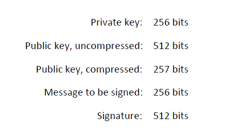

Figure 13 - sizes of various quantities in ECDSA

Note that while ECDSA can technically only sign messages 256 bits long, this is not a problem: messages are always hashed before being signed, so effectively any size message can be efficiently signed. Also, you can sign a hash pointer. If you sign a hash pointer, then the signature covers, or protects, the whole structure and everything the chain of hash pointers points to. For example, if you were to sign the hash pointer that was at the end of a block chain, the result is that you would effectively be digitally signing the that entire block chain.

### Public Keys as Identities

The idea is to take a public key and equate that to an identity of a person or an actor in a system. If you see a message with a signature that verifies correctly under a public key, *pk,* then you can think of this as *pk* is saying the message. via the **generateKeys** operation in our digital signature scheme. pk is the new public identity that you can use, and sk is the corresponding secret key that only you know and lets you speak for on behalf of the identity pk. In practice, you may use the hash of pk as your identity since public keys are large. If you do that, then in order to verify that a message comes from your identity, one will have to check (1) that pk indeed hashes to your identity, and (2) the message verifies under public key pk. Moreover, by default, your public key *pk* will basically look random, and nobody will be able to uncover your real-world identity by examining *pk.* But of course, once you start making statements using this identity, these statements may leak information that allows one to connect *pk* to your real-world identity.

#### **Application:** Decentralized identity management.

This brings us to the idea of decentralized identity management. Rather than having a central authority that you have to go to in order to register as a user in a system, you can register as a user all by yourself. You don't need to be issued a username nor do you need to inform someone that you're going to be using a particular name. If you want to be somewhat anonymous for a while, you can make a new identity, use it just for a little while, and then throw it away. All of these things are possible with decentralized identity management, and this is the way Bitcoin, in fact, does identity. These identities are called **addresses**, in Bitcoin jargon. And that's really just a hash of a public key.

**Pseudo-anonymity:** in Bitcoin you don't need to explicitly register or reveal your real‐world identity, but the pattern of your behavior might itself be identifying, this feature called Pseudo-anonymity.

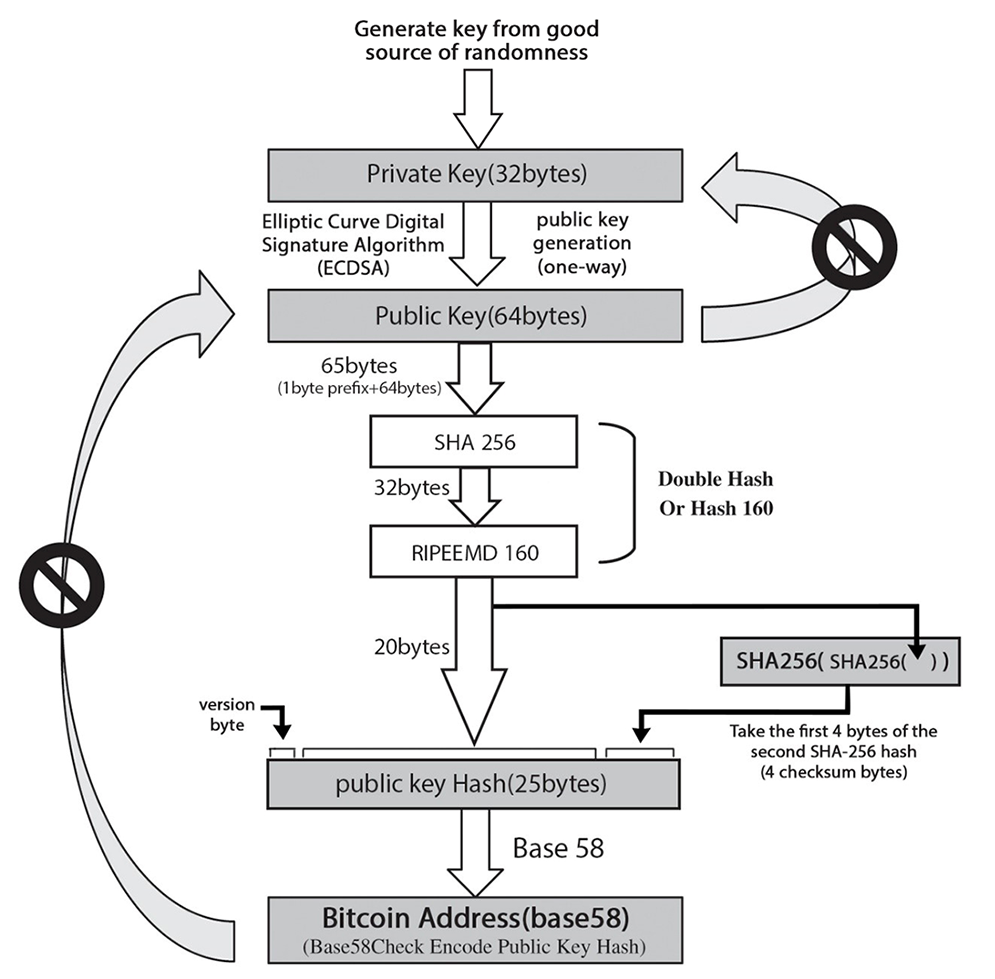
Figure 14 - Conversion from private key to Bitcoin Address

---

By [Mohammad Niknam](https://github.com/MohammadNiknam17)

[^1]: ***Brute-force attack** tries to find a collision by testing every possible input - by trial and error - until it finds two that match in hash results. in other words, find the original input that produced a known hash (called a preimage attack). It takes 2ⁿ attempts for an n-bit hash. After that, in 2ⁿ+1 attempt, collision is guaranteed.*

[^2]: *The fact that we can find a collision by only examining roughly the square root of the number of possible outputs results from a phenomenon in probability known as the birthday paradox. For further elaboration check [Appendices](https://github.com/MohammadNiknam17/Bitcoin-Blockchain-Technology-With-Focus-On-FPGA-Miners/blob/main/Chapters/7%20Appendices.md).*

[^3]: *Avalanche effect, is a term associated with a specific behavior of mathematical cryptographic functions. Which is: all the bits of function's output depend on every bit of input. In other word, A slight change in input (even change in one bit) should result a significant random change in output. Indeed, this effect provides "Preimage resistance" and "hiding" property.*
