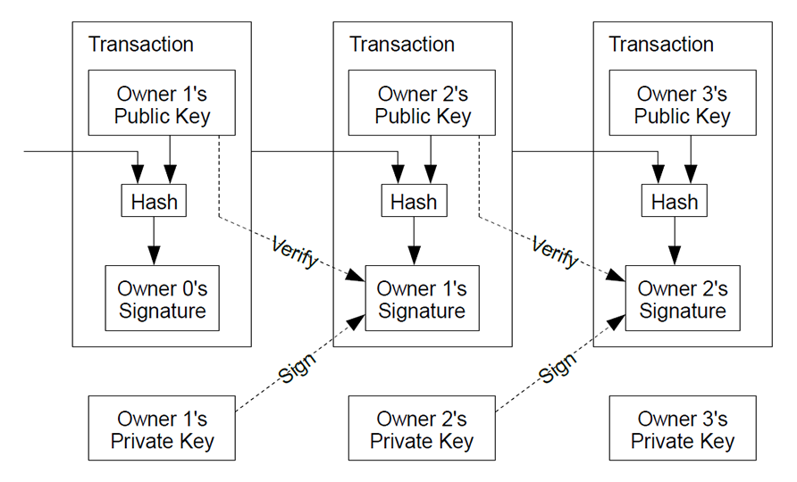
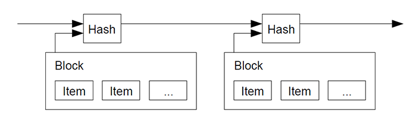
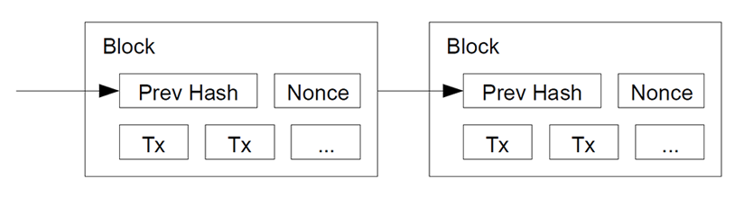
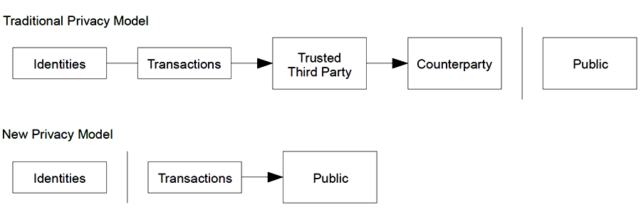
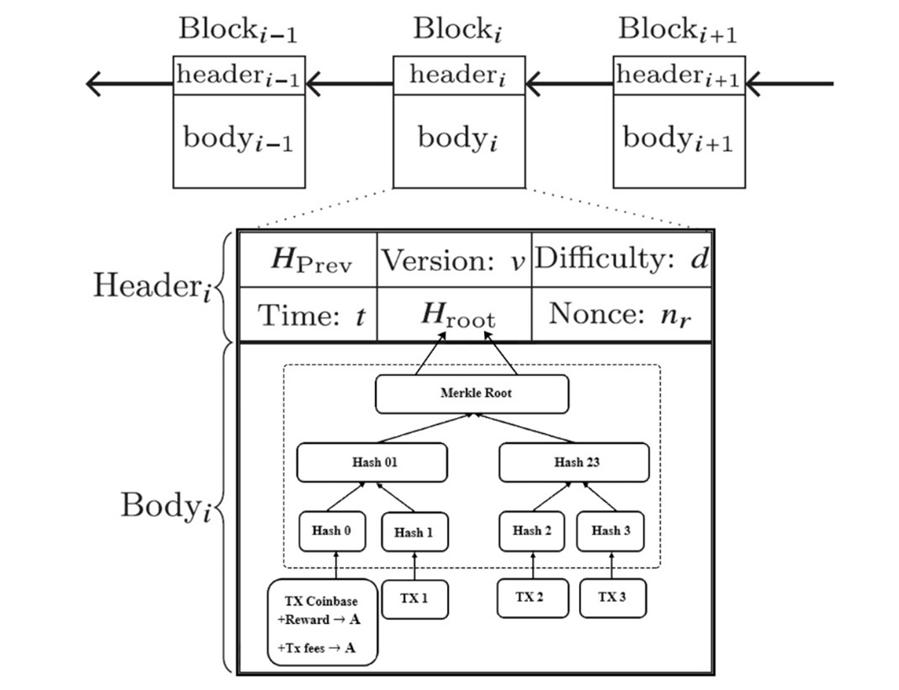
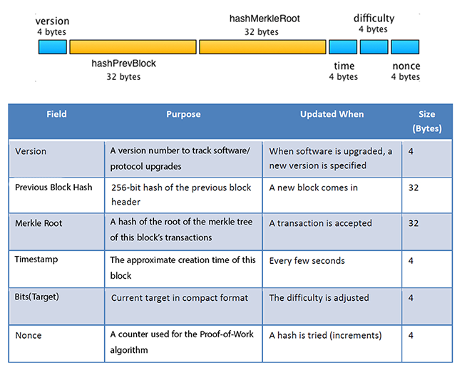

# 3- BITCOIN MECHANISM & NETWORK

## 3.1-Bitcoin in use

As said before, Bitcoin relies on cryptographic proof instead of trusted third parties. Public key cryptography is used to make and verify digital signatures that users use to send payments. Let’s suppose Alice and Bob are two users in the bitcoin network. Alice and Bob each have an address which is similar to a bank account number and tracks the number of bitcoins they have. The address is also associated with a public and private key (see fig. 14). The private key is used to sign transactions when sending bitcoins while the public key can be used by anyone to validate the transaction signature. Now, suppose Alice wants to send bitcoins to Bob:As said before, Bitcoin relies on cryptographic proof instead of trusted third parties. Public key cryptography is used to make and verify digital signatures that users use to send payments. Let’s suppose Alice and Bob are two users in the bitcoin network. Alice and Bob each have an address which is similar to a bank account number and tracks the number of bitcoins they have. The address is also associated with a public and private key (see fig. 14). The private key is used to sign transactions when sending bitcoins while the public key can be used by anyone to validate the transaction signature.

Now, suppose Alice wants to send bitcoins to Bob:

1. Bob sends his address to Alice.
2. Alice adds Bob's address and the amount of bitcoins to a
   'transaction' message.
3. Alice then signs the transaction message with her private key and
   announces her public key for signature verification.
4. Alice broadcast the transaction on the bitcoin network where all
   users can see the message.

All users on the Bitcoin network that know the transaction addresses belong to Alice and Bob can see that Alice has transferred bitcoins to Bob.

Later, Bob decides to transfer the same bitcoins to Charlie. Bob now repeats the steps Alice performed to send her bitcoin to Bob.

Another user, Eve cannot try to steal these bitcoins by replacing Bob or Charlie's address with her own. The transfers were signed with Alice and Bob's private key instructing that the coins were transferred from Alice to Bob and then Bob to Charlie. Once Charlie accepts the coins, he also accepts that the coins were first passed from Alice to Bob, and then from Bob to him.

This record of transactions between Alice, Bob, and Charlie is added to a constantly growing chain of blocks that contains the record of all transactions on the bitcoin network. The record of transactions is maintained by the bitcoin network, and each block is validated with proof of work before it is accepted into the chain. Valid blocks are chained together so that the transfer of bitcoins can be tracked. Once the block containing Alice’s transaction to Bob is added to the block chain, Bob can be confident that the transaction has been accepted by other computers in the network and permanently recorded. This prevents Alice from trying to send the same coins to another user and double spending her coins. The bitcoin network generates blocks every 10 minutes which would require Bob to wait at least this amount of time to be able to verify the transaction.

---

## 3.2-Bitcoin Concepts

### Transactions

Satoshi Nakamoto, bitcoin creator, defined an electronic coin as a chain of digital signatures. Each owner transfers the coin to the next by digitally signing a hash of the previous transaction and the public key of the next owner and adding these to the end of the coin. A payee can verify the signatures to verify the chain of ownership.

Figure 15 - Electronic coin as a chain of digital signatures.

The problem of course is the payee can't verify that one of the owners did not double-spend the coin. A common solution is to introduce a trusted central authority, or mint, that checks every transaction for double spending. After each transaction, the coin must be returned to the mint to issue a new coin, and only coins issued directly from the mint are trusted not to be double-spent. The problem with this solution is that the fate of the entire money system depends on the company running the mint, with every transaction having to go through them, just like a bank.

We need a way for the payee to know that the previous owners did not sign any earlier transactions. For our purposes, the earliest transaction is the one that counts, so we don't care about later attempts to double-spend. The only way to confirm the absence of a transaction is to be aware of all transactions. In the mint-based model, the mint was aware of all transactions and decided which arrived first. To accomplish this without a trusted party, transactions must be publicly announced, and we need a system for participants to agree on a single history of the order in which they were received. The payee needs proof that at the time of each transaction, the majority of nodes agreed it was the first received.

### Timestamp Server

The solution which Nakamoto proposed begins with a timestamp server. A timestamp server works by taking a hash of a block of items to be timestamped and widely publishing the hash. Each timestamp includes the previous timestamp in its hash, forming a chain, with each additional timestamp reinforcing the ones before it.

Figure 16 - Taking a hash of a block of items and hash of previous timestamp to be timestamped.

### Proof-of-Work

To implement a distributed timestamp server on a peer-to-peer basis, we will need to use a proof-of-work system. The proof-of-work involves scanning for a value that when hashed, such as with SHA-256, the hash begins with a number of zero bits. The average work required is exponential in the number of zero bits required and can be verified by executing a single hash.

For our timestamp network, we implement the proof-of-work by incrementing a nonce in the block until a value is found that gives the block\'s hash the required zero bits.[^1] Once the CPU effort has been expended to make it satisfy the proof-of-work, the block cannot be changed without redoing the work. As later blocks are chained after it, the work to change the block would include redoing all the blocks after it.

Figure 17 - Find a Nonce which satisfy proof-of-work target.

#### Incentive

By convention, the first transaction in a block is a special transaction that starts a new coin owned by the creator of the block. This adds an incentive for nodes to support the network, and provides a way to initially distribute coins into circulation, since there is no central authority to issue them. The steady addition of a constant of amount of new coins is analogous to gold miners expending resources to add gold to circulation. In our case, it is CPU time and electricity that is expended.

The incentive can also be funded with transaction fees. If the output value of a transaction is less than its input value, the difference is a transaction fee that is added to the incentive value of the block containing the transaction. Once a predetermined number of coins[^2] have entered circulation, the incentive can transition entirely to transaction fees and be completely inflation free.

The incentive may help encourage nodes to stay honest. If a greedy attacker is able to assemble more CPU power than all the honest nodes, he would have to choose between using it to defraud people by stealing back his payments, or using it to generate new coins. He ought to find it more profitable to play by the rules, such rules that favor him with more new coins than everyone else combined, than to undermine the system and the validity of his own wealth.

### Bitcoin Mining in summary

Bitcoin mining[^3] is essentially the process of cryptographic hashing a block header looking for a hash that, when interpreted as big number, has the very unlikely property of being bellow some small target value. Such target is automatically adjusted by the Bitcoin network to keep the generation of Bitcoins in a constant pace. When the computing power of the network increases, the target decreases causing the mining process to become more difficult. On the other hand, if the computing power of the network decreases, the target is increased also increasing the likelihood of finding a hash bellow this target.

Inside each block header, a special field called nonce is reserved for mining purposes only. Miners tries different nonce values looking for a valid hash (a hash bellow the target value). Each time a new nonce is tried, a new hash is obtained. If a nonce generates a valid hash, it is called a golden nonce.

For any good hashing algorithm (like SHA-256), there is no known way to find the golden nonce other than by sweeping all possible nonce values. This ensures that in order to find a golden nonce miners have to spend certain amount of computer power bringing out the proof-of-work concept which backs the reliability of the Bitcoin ecosystem.

### Consensus mechanism

The proof-of-work also solves the problem of determining representation in majority decision making. If the majority were based on one-IP-address-one-vote, it could be subverted by anyone able to allocate many IPs. Proof-of-work is essentially one-CPU-one-vote. The majority decision is represented by the longest chain, which has the greatest proof-of-work effort invested in it. If a majority of CPU power is controlled by honest nodes, the honest chain will grow the fastest and outpace any competing chains. To modify a past block, an attacker would have to redo the proof-of-work of the block and all blocks after it and then catch up with and surpass the work of the honest nodes. The probability of a slower attacker catching up diminishes exponentially as subsequent blocks are added.

Nodes always consider the longest chain to be the correct one and will keep working on extending it. If two nodes broadcast different versions of the next block simultaneously, some nodes may receive one or the other first. In that case, they work on the first one they received, but save the other branch in case it becomes longer. The tie will be broken when the next proof-of- work is found and one branch becomes longer; the nodes that were working on the other branch will then switch to the longer one.

#### Bitcoin consensus algorithm (simplified)

The steps to run the network are as follows:

1. New transactions are broadcast to all nodes.
2. Each node collects new transactions into a block.
3. Each node works on finding a difficult proof-of-work for its block.
4. When a node finds a proof-of-work, it broadcasts the block to all
   nodes.
5. Nodes accept the block only if all transactions in it are valid and
   not already spent.
6. Nodes express their acceptance of the block by working on creating
   the next block in the chain, using the hash of the accepted block as
   the previous hash.

New transaction broadcasts do not necessarily need to reach all nodes. As long as they reach many nodes, they will get into a block before long. Block broadcasts are also tolerant of dropped messages. If a node does not receive a block, it will request it when it receives the next block and realizes it missed one.

### Privacy

The traditional banking model achieves a level of privacy by limiting access to information to the parties involved and the trusted third party. The necessity to announce all transactions publicly precludes this method, but privacy can still be maintained by breaking the flow of information in another place: by keeping public keys anonymous. The public can see that someone is sending an amount to someone else, but without information linking the transaction to anyone. This is similar to the level of information released by stock exchanges, where the time and size of individual trades, the \"tape\", is made public, but without telling who the parties were.

Figure 18 - Traditional-Privacy-Model Vs New-Privacy-Model

---

## 3.3-Bitcoin blockchain data structure

An overview of the Bitcoin blockchain data structure is depicted in Figure below. To be stored in the Bitcoin ledger, every individual transaction should be embedded in a Bitcoin block data structure. the Bitcoin blockchain is a sequence of blocks linked with hash values. Each block consists of a block header and a block body. Transactions are stored in the block body, and digest information and other identifiers are recorded in the block header. A blockchain is maintained by the nodes participating in the network, and the data consistency among the nodes is ensured according to predetermined rules of Consensus.

Figure 19 - A overview of the Bitcoin blockchain data structure.

### Block Header

A block is "solved" (published and considered valid by peers) when the hash of the block header is below the current target. The block header consists of 640 bits (80 bytes) as shown in figure below. Most of fields are constants, but miners can play with one of them: nonce.

Figure 20 - The Block header fields and structure, The block header is an 80-byte value.

---

By [Mohammad Niknam](https://github.com/MohammadNiknam17)

[^1]: *This concept will discuss with more details in next section, titled by \"Difficulty\".*
    
[^2]: *The total supply of BTC is limited and pre-defined in the Bitcoin protocol at 21-million. Since 2009 to early 2022 approximately 18.9-milion of it mined (have entered circulation with the mining reward).*
    
[^3]: *This subject will discuss in next section, with more details.*
