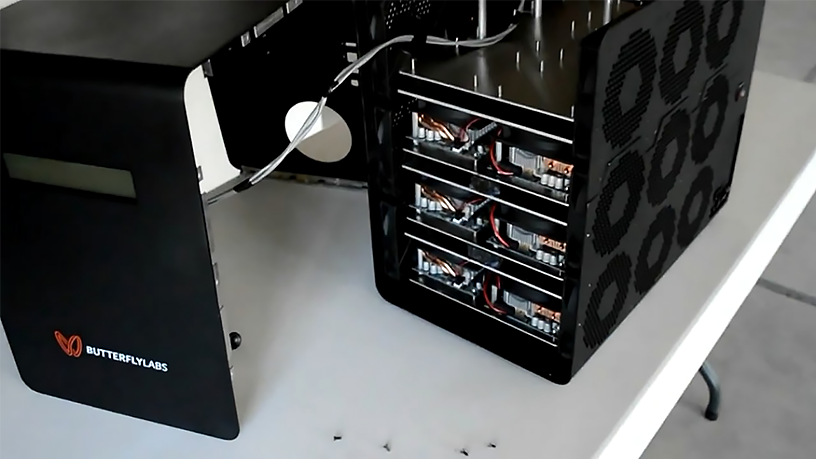

# 5-FPGA

## 5.1-Introduction

Field programmable gate array (FPGA) is a type of integrated circuit (IC) that can be programmed for different algorithms after fabrication. FPGA first introduced in 1985. Modern FPGA devices consist of up to four million logic cells that can be configured to implement a variety of software algorithms. an FPGA provides significant cost advantages in comparison to an IC development effort and offers the same level of performance in most cases. FPGA is developed version of PLD[^1]. In PLD\'S programmed after manufacturing in field, it has limited programmability. Field programmable gate is capable of implementing any digital circuit. This provides developer of creating wide array of logical structure minimum low cost.

Figure 31 - A sample FPGA - Xilinx spartan series

### Requirement of FPGAs

By the early 1980's large scale integrated circuits (LSI) formed the back bone of most of the logic circuits in major systems. Microprocessors, bus/IO controllers, system timers etc. were implemented using integrated circuit fabrication technology. custom \"glue logic\"[^2] or interconnects were still required to help connect the large integrated circuits in order to:

* Generate global control signals (for resets etc.)
* Data signals from one subsystem to another sub system.

First attempt to this problem was developing custom ICs, but it was not a solution for the problem. custom ICs have their own disadvantages. They are relatively very expensive to develop, and delay introduced for product to market (time to market) because of increased design time. There are two kinds of costs involved in development of custom ICs

1. Cost of development and design
2. Cost of manufacture

FPGAs were introduced as an alternative to custom ICs for implementing entire system on one chip and to provide flexibility of reporogramability to the user. One of the major advantages of FPGA over custom ICs is circuit implementation time is very less because physical layout, masking etc. is absent in this process. Circuit implementation is done with help of the advanced CAD[^3] tools.

Figure 32 -- FPGA Development Boards -Xilinx Spartan 6

---

## 5.2-Architecture and Structure of FPGA

FPGA is a device that contains a matrix of reconfigurable gate array logic circuitry. When a FPGA is configured, the internal circuitry is connected in a way that creates a hardware implementation of the software application. Unlike processors, FPGAs use dedicated hardware for processing logic and do not have an operating system. FPGAs are truly parallel in nature so different processing operations do not have to compete for the same resources. As a result, the performance of one part of the application is not affected when additional processing is added. Unlike ASICs and hard-wired printed circuit board (PCB) designs which have fixed hardware resources, FPGA-based systems can literally rewire their internal circuitry to allow reconfiguration after the control system is deployed to the field.

A single FPGA can replace thousands of discrete components by incorporating millions of logic gates in a single integrated circuit (IC) chip. The internal resources of an FPGA chip consist of a matrix of configurable logic blocks (CLBs) surrounded by a periphery of I/O blocks. Signals are routed within the FPGA matrix by programmable interconnect switches and wire routes.

Figure 33 - Basic FPGA Architecture

The basic structure of an FPGA is composed of the following elements:

- **Look-up table (LUT):** This element performs logic operations.
- **Flip-Flop (FF):** This register element stores the result of the LUT.
- **Multiplexer:** a device that can receive multiple input signals and synthesize a single output signal.
- **Input/Output (I/O) pads:** These physically available ports get data in and out of the FPGA.

The combination of these elements results in the basic FPGA architecture shown in figure below.

Figure 34 - FPGA Architecture

### Internal Architecture of LUT

A combinational logic is made up of basic logic gate connected through wire. In FPGA these gates are simulated using look-up table (LUT). A n-input LUT requires $2^{n}$ bits of SRAM to store lookup table and $2^{n} - 1$ multiplexer to read individual bit. In general, 4-input look-up table is used but nowadays 6 input look-up table is used.

Figure 35 - Four input LUT - (left) circuitry for read - (right) circuitry for write.

The value in0 to in3 are used to determine which SRAM bit is given at output. Boolean function is stored in SRAM cell. SRAM cell is simply a shift register with one-bit width and 2\^n bit depth. The Bit is shifted bit-by-bit into LUT when FPGA is programmed. LUT can also be used as memory element on FPGA. When FPGA is programmed LUT is used as distributed RAM. The multiple LUTs are combined to make wider or deeper memories.

### Routing Architecture - switch matrix

Interconnect is used for communicate between different logic island (LIs) these interconnects are configurable. It consists of horizontal and vertical channels (bundle of wire). At interconnect of routing channel there is a programmable links which determine how wire is connected, how input output is routed in particular logic island. All wires are connected to additional three wires at interconnection point but which connection is active is determine by programmable switch.

Figure 36 - (left) Routing architecture with switch matrix - (right) SRAM-controlled Programmable Switches

figure above, shows two applications of SRAM cells: for controlling the gate nodes of pass-transistor switches and to control the select lines of multiplexers that drive logic block inputs. The figure(right) gives an example of the connection of one logic block (represented by the AND-gate in the upper left corner) to another through two pass-transistor switches, and then a multiplexer, all controlled by SRAM cells.

### Additional Elements In Contemporary FPGA Architectures

Contemporary FPGA architectures incorporate the basic elements along with additional computational and data storage blocks that increase the computational density and efficiency of the device. These additional elements are:

- Embedded memories for distributed data storage
- Phase-locked loops (PLLs) for driving the FPGA fabric at different clock rates
- High-speed serial transceivers
- Off-chip memory controllers
- Multiply-accumulate blocks (DSP Blocks[^4])

Figure 37 - Contemporary FPGA Architecture

The combination of these elements provides the FPGA with the flexibility to implement any software algorithm running on a processor.

---

## 5.3-FPGA Programming

The most important steps and tools of the design flow to produce an FPGA-circuit are depicted in figure below.

Figure 38 - FPGA design flow.

### HDL & Synthesize

Programming on FPGA is same as describe the structure and behavior of electronic circuits and connecting wires in circuit, this is done by using a hardware description language (HDL) such as **VHDL** or **Verilog**. Synthesizer converts HDL into gate level netlist. A gate level netlist is basically your fitted design, before its converter to a programming file. It contains all of the logic and delays of the final system. It allows you to use your testbench from the simulation testing to test the final design. So, synthesis process generates netlist for each design element. The resulting netlists is saved to an ***NGC (Native Generic Circuit*)** file[^5].

### Translate process

Translate process combines all the input netlists and constraints to a logic design file. This information is saved as a ***NGD (Native Generic Database)*** file. This can be done using NGD Build program. Here, defining manufacturing constraints is assigning the ports in the design to the physical elements (e.g., I/O pins, clock, switches, buttons etc.) Of the targeted device and specifying time requirements of the design. This information is stored in a file named ***UCF (User Constraints File).*** Generally, NGC allow behavioral simulation and NGD allow timing simulation.

### Map process

MAP process divides the whole circuit with logical elements into sub blocks such that they can be fit into the FPGA logic blocks. That means map process fits the logic defined by the NGD file into the targeted FPGA elements (configurable Logic Blocks (CLB), Input Output Blocks (IOB)) and generates an ***NCD (Native Circuit Description)*** file which physically represents the design mapped to the components of FPGA.

### **Place and Route**

PAR program is used for this process. The place and route process places the sub blocks from the map process into logic blocks according to the constraints and connects the logic blocks. A tradeoff between all the constraints is taken account by the place and route process. The PAR tool takes the mapped NCD file as input and produces a completely routed NCD file as output. Output NCD file consists of the routing information.

### Device Programming - Bitstream Generation

Now the design must be loaded on the FPGA. But the design must be converted to a format so that the FPGA can accept it. BITGEN program deals with the conversion. it encodes design in binary known as **Bitstream *(a .BIT file)***. The routed NCD file is given to the BITGEN program to generate a bitstream which can be used to configure the target FPGA device. Inside FPGA a finite state machine control by Bitstream which extract configuration data from Bitstream. This can be done using a cable.

Figure 39 - FPGA implementation - Step by Step

---

## 5.4-FPGAs Vs ASICs

ASIC microchip is designed and manufactured for one specific application and does not allow you to reprogram or modify it after it is produced. This means ASICs are not intended for general use.

For chose technology to design or develop a chip, there are several factors to consider:

- Design Flow
- Flexibility
- Performance and Efficiency
- Cost and Time to Market
- Power Consumption

The main properties and applications of ASICs and FPGAs are listed below:

#### FPGAs

- Off-the-shelf, that is available immediately and does not need to be specially made to suit a particular purpose.
- Reconfigurability, may be reprogrammed in the field (gateware upgrade) -- (New features - Bug fixes)
- Rapid development cycle (minutes / hours) - Short time to market
- Low development cost

#### ASICs

- Higher performance - Low power
- Analog designs possible
- Long development cycle (weeks /months)
- Design cannot be changed once it  is produced
- Better radiation hardness
- Extremely high development cost (ASICs are produced at a semiconductor fabrication facility (“fab") according to your design)
- Lower cost per device compared to FPGA, when large quantities are needed

Figure 40 - FPGAs Vs ASICs

---

## 5.5-FPGA As Bitcoin Miner

FPGAs have advantages in bitcoin mining due to their lower power usage and higher levels of hardware customization. As you can recall, from previous sections, mining is all about hashing a candidate block and seeing if the hash meets certain difficulty criteria. When bitcoin was first introduced, central processing units (CPUs) from Intel and AMD were used as miners, but they were quickly replaced by graphics processing units (GPUs) from Nvidia and AMD. CPUs have relatively few  arithmetic logic units (ALUs) and are designed to run more general executive and decision-making  software. GPUs have the ability to perform lots of repetitive work because they contain large  numbers of ALUs designed to increase their ability to calculate the mathematical formulas to drive pixels on a  screen. These same ALUs can be repurposed to repeatedly try different hashes, and the number of ALUs  has a direct effect on the hash output. However, both the CPU and GPU are designed for multipurpose, universal computing. This means that both can execute any valid code; in computing terms this is called \"Turing-completeness\". On the other hand, FPGAs are programmed for a specific purpose. FPGAs can be configured to compute the SHA-256 algorithm with  even more efficiency since their hardware is developed for this task. This is the reason why FPGAs are faster than the best GPUs at performing hashing calculations.

FPGA can be connected to a computer with USB cable (for many FPGAs, USB-HUB may be needed).  When mining with an FPGA, the mining software creates the necessary work to bitcoin system and connect to network. The software primarily retrieves work from the bitcoin network and sends it to the FPGA miner. the FPGA hashes away to find a possible solution. The mining software monitors all this work to make sure that a valid solution taken. when a valid solution found, the mining software reports to the bitcoin network.

### FPGA mining versus GPU and CPU and ASIC mining

As you can see, from a comparison shows in figure below, FPGAs are faster at performing hashing calculations than both CPUs and GPUs. They are also more efficient as measured by the use of electricity per hashing unit. The increase in hashing speed in FPGAs is a significant improvement over GPUs and even more so over CPUs. But ASICs makes the game changing. and other older generations of hardware mining (CPUs, GPUs, FPGAs) can no longer compete with ASICs.

Figure 41 - Comparison of typical examples of hardware mining generations. Mentioned Mining speed is at the high performance of hardware, and each of examples are a good one for mining in their type.

One of the biggest reasons CPUs and GPUs are no longer used as miners is because the electricity to run them often cost more than the amount of bitcoins received from mining. ASICs offer the best performance per watt.

Figure 42 - ButterflyLabsMiniRig miner 25GH/s - A commercial high performance package device contains several FPGAs.

### Profitability of FPGA mining

As we have mentioned earlier, the Bitcoin network hash rate is really high now,  and even mining with FPGAs and some ASICs does not guarantee profits. This is due to the fact  that during the mining process you are competing with other miners to try to solve a block. If those other miners are running a larger percentage of the total mining  power, you will be at a disadvantage, as they are more likely to solve a block.

---

By [Mohammad Niknam](https://github.com/MohammadNiknam17)

[^1]: *PLDs are array-oriented devices that typically have an AND-OR structure with wide-input AND gates feeding a narrower OR gate. The difference between FPGA and PLD is that **FPGA incorporates logic blocks instead of fixed AND-OR gates**. FPGAs are designed for having higher gate count whereas, PLDs are used for lesser gate counts.*
    
[^2]: *Glue logic is a special form of digital circuitry that allows different types of logic chips or circuits to work together by acting as an interface between them.*
    
[^3]: *Computer-aided design (CAD) is the use of computers to aid in the creation, modification, analysis, or optimization of a design.*
    
[^4]: *The most complex computational block available in a common FPGA is the DSP block which is an arithmetic logic unit (ALU).*
    
[^5]: *For Xilinx Synthesis Technology (XST)*
