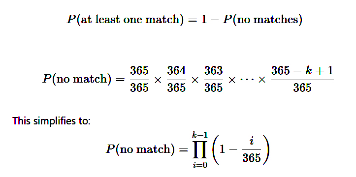

# Appendices

## A1-the Birthday paradox problem

The Birthday Paradox is a famous problem in probability theory that reveals something surprising: in a group of just 23 people, there is a more than 50% chance that two people share the same birthday. At first, this seems unlikely and Most people expect the number of people needed for a likely match to be much higher. 

#### The math behind the Birthday paradox

Let’s define: 
•	N = 365 (number of possible birthdays)
•	k = number of people
We want to find the smallest k such that the probability of at least one collision (shared birthday) is greater than 50%. To understand it intuitively, consider this: 

**Step1:** calculate the probability of **no one sharing a birthday** (i.e., all birthdays are unique) is easier. and then subtract that from 1 gives the probability of at least one shared birthday.

Figure 45 - calculate the probability of no one sharing a birthday.

For probability of no one sharing a birthday, the first person can have any birthday (365/365). The second person then must have a different birthday (364/365), the third must avoid the first two (363/365), and so on.

Step2: finding k in the way that satisfy our desire to probability of 50%. When you multiply these decreasing probabilities for 23 people, the result is less than 50%. That means the chance of at least one shared birthday is greater than 50%.

Figure 46 – calculation results of probability of no one sharing a birthday (middle column) and probability of at least one collision (right column) for some examples of K values (number of peoples). K=23 is the minimum number of peoples that is needed to satisfy the probability of at least one collision > 50%

This counterintuitive result is why it's called a paradox which implies our instincts about probability don't always match the math.

#### The Birthday attack

Now, let's connect this to cryptography, where the **"Birthday Paradox"** inspires a technique known as **“the Birthday Attack”**. In cryptography, Hash functions are designed to avoid collisions, which occur when two different inputs produce the same hash. But because of Birthday Paradox, we know that finding such collisions may require fewer attempts than expected, roughly estimated about $√N$  tries [^1] , where N is the number of possible hash outputs. This is called the birthday bound. Use of a n-bit hash function gives n/2-bit collision resistance. 

A Birthday Attack exploits the mathematical insight, which we get from birthday paradox to find collisions in hash functions faster than brute-force methods. Having the same birthday is the analogue of a "collision" in a hash function. If a hacker wants to create two different messages that produce the same hash (for example, one innocent-looking contract and one malicious version), they can use a birthday attack to find such a pair. Once found, they can show the safe message for verification and then secretly switch to the harmful one-because the hash is the same, no one suspects the switch. This kind of attack is particularly dangerous for digital signatures and systems that rely on hash integrity for verification. To defend against such attacks, modern cryptographic systems use strong hash functions (like SHA-256) with large output sizes, making it impractical to find collisions even with the birthday attack.

---

By [Mohammad Niknam](https://github.com/MohammadNiknam17)

[^1]: *This is an approximation method. For accurate calculation replace N=365 by N=number of possible hash outputs (for instance SHA-256: $N=2^{256}$ ) and do the calculation explained before. Because the exact formula is mathematically heavy for very large number of hash outputs, $√N$ method is the common approximation used in cryptographic realm, that gives fast estimation for the value of K (i.e. how many hash outputs we need to generate before there's a good chance of a collision, and so how much the crypto-system is collision resistant in comparison.)*

