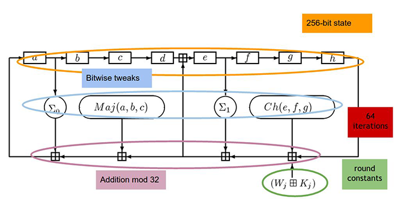

# 4-BITCOIN MINING

Bitcoin, at a simple glance, is three things. First it is a protocol (or set of rules) that defines how the network should operate. Second it is a software project that implements that protocol. Third it is a network of computers and devices running software that uses the protocol to create and manage the Bitcoin currency. There\'s no central authority for Bitcoins, similar to a central bank which controls currencies. Instead, programmers solve complex puzzles to endorse Bitcoin transactions and get Bitcoins as a reward. This activity is called Bitcoin mining, Mining is defined in the protocol, implemented in software, and is an essential function in managing the Bitcoin network. Miners validate every transaction, they build and store all the blocks, and they reach a consensus on which blocks to include in the block chain.

## 4.1-The task of Bitcoin miners

To be a Bitcoin miner, you have to join the Bitcoin network and connect to other nodes. Once you're connected, there are six tasks to perform:

1. ***Listen for transactions.*** First, you listen for transactions on the network and validate them by checking that signatures are correct and that the outputs being spent haven't been spent before.
2. ***Maintain block chain and listen for new blocks.*** You must maintain the block chain. You start by asking other nodes to give you all of the historical blocks that are already part of the block chain before you joined the network. You then listen for new blocks that are being broadcast to the network. You must validate each block that you receive by validating each transaction in the block and checking that the block contains a valid nonce. We'll return to the details of nonce checking later in this section.
3. ***Assemble a candidate block.*** Once you have an up‐to‐date copy of the block chain, you can begin building your own blocks. To do this, you group transactions that you heard about into a new block that extends the latest block you know about. You must make sure that each transaction included in your block is valid.
4. ***Find a nonce that makes your block valid.*** This step requires the most work and it's where all the real difficulty happens for miners.
5. ***Hope your block is accepted.*** Even if you find a block, there's no guarantee that your block will become part of the consensus chain. There's bit of luck here; you have to hope that other miners accept your block and start mining on top of it, instead of some competitor's block.
6. ***Profit***. If all other miners do accept your block, then you profit! At the time of this writing in early 2022, the block reward is 6.25 bitcoins which is currently worth over \$312,500. In addition, if any of the transactions in the block contained transaction fees, the miner collects those too. Mathematically, transaction fees are the difference between the amount of bitcoin sent and the amount received. Conceptually, transaction fees are a reflection of the speed with which a user wants their transaction validated on the blockchain. Transaction fees are based on the data volume of a transaction and the congestion of the network. through the Segregated Witness (SegWit) protocol upgrade in 2017, now A block can contain a maximum theoretical limit of 4 MB of data and a more realistic limit of 2 MB. The default limit before the upgrade was 1MB. so, there is a limit to how many transactions can be processed in one block. A larger transaction will take up more block data. Thus, larger transactions typically pay fees on a per-byte basis. If you wish to have your transaction confirmed immediately, your optimal fee rate may vary significantly.

We can classify the steps that a miner must take into two categories.

1. ***Validating transactions and blocks.*** Some tasks help the Bitcoin network and are fundamental to its existence. These tasks are the reason that the Bitcoin protocol requires miners in the first place
2. **The race to find blocks and profit.** Some tasks aren't necessary for the Bitcoin network itself but are intended to incentivize miners to perform the essential steps. Of course, both of these are necessary for Bitcoin to function as a currency, since miners need an incentive to perform the critical steps.

### Finding a valid block

In previous sections, we saw that there are two main hash‐based structures. There\'s the block chain where each block header points to the previous block header in the chain, and then within each block there\'s a Merkle tree of all of the transactions included in that block. The first thing that you do as a miner is to compile a set of valid transactions that you have from your pending transaction pool into a Merkle tree. Of course, you may choose how many transactions to include up to the limit on the total size of the block. You then create a block with a header that points to the previous block. In the block header, there's a 32-bit nonce field, and you keep trying different nonces looking for one that causes the block's hash to be under the target. For practical simple example, to begin with the required number of zeros. A miner may begin with a nonce of 0 and successively increment it by one in search of a nonce that makes the block valid.

Figure 21 - Finding a valid block. In this example, the miner tries a nonce of all 0s. It does not produce a valid hash output, so the miner would then proceed to try a different nonce.

In most cases you\'ll try every single possible 32-bit value for the nonce and none of them will produce a valid hash. At this point you\'re going to have to make further changes. Notice in Figure above that there's an additional nonce in the Coinbase transaction that you can change as well. After you\'ve exhausted all possible nonces for the block header, you\'ll change the extra nonce in the Coinbase transaction, for example, by incrementing it by one, and then you\'ll start searching nonces in the block header once again.

When you change the nonce parameter in the Coinbase transaction, the entire Merkle tree of transactions has to change (See Figure below). Since the change of the Coinbase nonce will propagate all the way up the tree, changing the extra nonce in the Coinbase transaction is much more expensive operation than changing the nonce in the block header. For this reason, miners spend most of their time changing the nonce in the block header and only change the Coinbase nonce when they have exhausted all of the $2^{32}$ possible nonces in the block header without finding a valid block.

Figure 22 - Changing a nonce in the Coinbase transaction propagates all the way up the Merkle tree.

The vast, vast majority of nonces that you try aren\'t going to work, but if you stay at it long enough, you\'ll eventually find the right combination of the extra nonce in the Coinbase transaction and the nonce in the block header that produce a block with a hash under the target. When you find this, you want to announce it as quickly as you can and hope that you can profit from it.

#### Is everyone solving the same puzzle?

if every miner just increments the nonces as described, aren't all miners solving the exact same puzzle? Won't the fastest miner always win? The answer is no! Firstly, it's unlikely that miners will be working on the exact same block as each miner will likely include a somewhat different set of transactions and in a different order. But more importantly, even if two different miners were working on a block with identical transactions, the blocks would still differ. Recall that in the Coinbase transaction, miners specify their own address as the owner of the newly minted coins. This address by itself will cause changes which propagate up to the root of the Merkle tree, ensuring that no two miners are working on exactly the same puzzle unless they share a public key. This would only happen if the two miners are part of the same mining pool (which we'll discuss shortly), in which case they'll communicate to ensure they include a distinct nonce in the Coinbase transaction to avoid duplicating work.

### Difficulty

The Bitcoin mining difficulty defines how hard it is to mine a new block. In other word, Difficulty is a measure of how difficult it is to find a hash below a given target. The Bitcoin network has a global block difficulty. Valid blocks must have a hash below this target.

There are two values we need to consider:

**Target (\"Bits\"):** The Bitcoin difficulty target is a 256-bitnumber. It is stored as an encoded packed representation (called \"Bits\") for its actual hexadecimal target. The target states how high a block hash can be in order to fulfill the mining condition. The higher the target the easier it is to find a value below it and the lower the difficulty.

**Difficulty:** Is a numerical expression of how difficult it is to find a suitable hash compared to the easiest difficulty of 1. That means, Floating point representation of difficulty shows how much current target is harder than the one used in the genesis block.

Figure below shows summary information of first block mined in 2022:

Figure 23 - summary information of first block mined in 2022.

For this block, as of January 2022, figure below shows how to decode the target \"bits\" and determine the mining difficulty.

Figure 24 - decode the target \"bits\" and determining prosses for the mining difficulty and target.

So, the hash of any valid block has to be below this value. In other words, one in about $2^{76}$ nonces (Based on calculation shows in figure above) that you try will work, which is a really huge number. One approximation is that it\'s 1680-times greater than the human population of earth squared. So, if every person on earth was themselves their own planet earth with 7.8 billion people on it, the total number of people multiply by 1680, would be close to $2^{76}$.

#### Determining the difficulty

Difficulty gets adjusted according to the hash rate in order to maintain a constant block finding time and to dispense the block reward not too fast or too slow. The mining difficulty changes every 2016 blocks, which are found about once every 2 weeks. It is adjusted based on how efficient the miners were over the period of the previous 2016 blocks according to this formula:

**next_difficulty = (previous_difficulty \* 2016 \* 10 minutes) / (time to mine last 2016 blocks)**

Note that 2016\*10 minutes is exactly two weeks, so 2016 blocks would take two weeks to mine 2016 blocks if a block were created exactly every 10 minutes. So, the effect of this formula is to scale the difficulty to maintain the property that blocks should be found by the network on average about once every ten minutes. There's nothing special about 2 weeks, but it's a good trade‐off. If the period were much shorter, the difficulty might fluctuate due to random variations in the number of blocks found in each period. If the period were much higher, the network's hash power might get too far out of balance with the difficulty.

You can see in Figure below that over time the mining difficulty keeps increasing. It\'s not necessarily a steady linear increase or an exponential increase, but it depends on activity in the market. Mining difficulty is affected by factors like how many new miners are joining, which in turn may be affected by the current exchange rate of Bitcoin. Generally, as more miners come online and mining hardware gets more efficient, blocks are found faster and the difficulty is increased so that it always takes about ten minutes to find a block.

Figure 25 - Difficulty over time - left: over actual scale time - Right: over Log scale time.

Each Bitcoin miner independently computes the difficulty and will only accept blocks that meet the difficulty that they computed. Miners who are on different branches might not compute the same difficulty value, but any two miners mining on top of the same block will agree on what the difficulty should be. This allows consensus to be reached.

---

## 4.2-Mining Hardware

Notice that the computation that miners have to do is very difficult. In this section, we'll discuss why it is so computationally difficult and take a look at the hardware that miners use to perform this computation.

The core of the difficult computation miners are working on is the SHA‐256 hash function. We discussed hash functions and properties of those in previous sections. SHA‐256 is a general-purpose cryptographic hash function that's part of a bigger family of functions that was standardized in 2001 (SHA stands for Secure Hash Algorithm). SHA‐256 was a reasonable choice as this was strongest cryptographic hash function available at the time when Bitcoin was designed. It is possible that it will become less secure over the lifetime of Bitcoin, but for now it remains secure.[^1]

### A closer look at SHA‐256

Figure below shows more detail about what actually goes on in a SHA‐256 computation. SHA‐256 maintains 256 bits of state(variable). The state(variable) is split into eight 32‐bit words(a-b-c-d-e-f-g-h) which makes it highly optimized for 32‐bit hardware. for first 512-bit block of message these eight 32‐bit words are Initialization Vectors (IV). and for subsequent blocks of message, 256 bits of the state(variable) are 256-bit hash of previous block.

At a very simple glance, for each 512-bit block of message (or for each compression function), message prepare and schedule of sixty-four 32-bit words. in each round of 64 round, a number of words in the state are taken (some with bitwise tweaks related to words of message applied) and added together mod 32. The entire state is then shifted[^2] over with the result of the addition becoming the new left most word of the state (the result value placed as new eight 32‐bit words of state).

this process repeated 64-time for each block of message. And the latest result of eight 32‐bit words of state, forms the hash of the block.

Figure 26 - The structure of SHA‐256. This is one round of the compression function.

Figure above shows just one round of the SHA‐256 compression function. A complete computation of SHA‐256 does this for 64 iterations. During each round, there are slightly different constants applied so that no iteration is exactly the same.

The task for miners is to compute this function as quickly as possible. Remember that miners are racing each other so the faster they do this, the more they earn. Bitcoin actually requires SHA‐256 to be applied twice to a block in order to get the hash that is used by the nodes. The reasons for the double computation are not fully specified, but at this point, it's just something that miners have to deal with.

### CPU mining

The first generation of mining was all done on general purpose computers that is general purpose central processing units (CPUs). In fact, CPU mining was running a pseudocode like the code shown in Figure below. That is, miners searched over nonces in a linear procedure, computed SHA 256 in software and checked if the result was a valid block.

Figure 27 - CPU mining pseudocode.[^3]

How fast will this run on a general-purpose computer? On a good desktop PC, you might expect to compute about on scale by 50 million hashes per second (MH/s).

If you\'re mining on a general-purpose PC today, CPU mining is no longer profitable with the current difficulty. For the last few years, anyone trying to mine on a CPU probably doesn't understand how Bitcoin works and was probably pretty disappointed that they never made any money doing it.

### GPU mining

The second generation began when people started to get frustrated with how slow their CPUs were and instead used their graphics card, or graphics processing unit (GPU).

Bitcoin mining can be parallelized easily because you can try computing multiple hashes at the same time with different nonces. In 2010, a language called OpenCL was released. OpenCL is a general-purpose language to do things other than graphics on a GPU. It\'s a high level‐language and over time people have used it to run many types of computation more quickly on graphics cards. This paved the way for Bitcoin mining on GPUs.

Mining with graphics cards had several attractive properties at the time. For one thing, they\'re easily available and easy for amateurs to set up. They're the most accessible high‐end hardware that\'s available to the general public. They also have some properties that make them specifically good for Bitcoin mining. They\'re designed for parallelism so they have many Arithmetic Logic Units (ALUs) that can be used for simultaneous SHA‐256 computations. Some GPUs also have specific instructions to do bitwise operations that are quite useful for SHA‐256.

Most graphics cards can also be ***overclocked***, meaning you can run them faster than they\'re actually designed for if you want to take on the risk that they might overheat or malfunction. With Bitcoin mining, it might be profitable to run the chip much faster than it was designed for even if you induce a few errors by doing so. For example, consider you can run your graphics card 50 percent faster but doing so will cause errors in the SHA‐256 computation to 30 percent of the time. In the above example, the throughput is 1.5x compared to not overclocking, whereas the success rate is 0.7x. The product is 1.05, which means overclocking increases your expected profits by 5%.

Finally, you can drive many graphics cards from one motherboard and CPU. So, you can take your computer, which will be running your actual Bitcoin node which gathers transactions from the network and assembles blocks, and attach multiple graphics cards to it to try to find the right nonces to make the SHA-256 of the block valid. Figure below shows a setup to drive many, many GPUs from a single CPU. This was still in the early days of Bitcoin when miners were still mostly hobbyists without much experience running servers, but they came up with some quite ingenious designs for how to pack many graphics cards into a small place and keep them cool enough to operate.

Figure 28 - A home‐built rack of GPUs used for Bitcoin mining. You can also see the fans that they used to build a primitive cooling system.

On a good graphics card with aggressive tuning, you might get on scale by 500 MH/s, or 500 million hashes per second.

#### Disadvantages of GPU mining

GPU mining has some disadvantages. GPUs have a lot of hardware built into them for doing video processing that can't be utilized for mining. Specifically, they have a large number of floating-point units that aren't used at all in SHA‐256. GPUs also don\'t have the greatest cooling characteristics when you put a lot of them next to one another. They're not designed to run side by side as they are in the picture; they\'re designed to be in a single box doing graphics for one computer.

GPUs can also draw a fairly large amount of power, so a lot of electricity is used relative to a computer. Another disadvantage initially was that you had to either build your own board or buy expensive boards to house multiple graphics cards.

### FPGA mining

Around 2011 some miners started switching from GPUs to FPGAs, or Field Programmable Gate Arrays, after the first implementation of Bitcoin mining came out in Verilog, a hardware design language that's used to program FPGAs. The general rationale behind FPGAs is to try to get close as possible to the performance of custom hardware while also allowing the owner of the card to customize it or reconfigure it "in the field." By contrast, custom hardware chips are designed in a factory and do the same thing forever.

FPGAs offer better performance than graphics cards, particularly on "bit fiddling" operations which are trivial to specify on an FPGA. Cooling is also easier with FPGAs and, unlike GPUs, you can theoretically use nearly all of the transistors on the card for mining. Like with GPUs, you can pack many FPGAs together and drive them from one central unit, which is exactly what people began to do (see Figure below). Overall, it was possible to build a big array of FPGAs more neatly and cleanly than you could with graphics cards.

Figure 29 - A home‐built rack of FPGAs.

Using an FPGA with a careful implementation, you might get up to several GH/s billion hashes per second. This is certainly a large performance gain over CPUs and GPUs.

Despite the performance gain, the days of FPGA mining were quite limited. Firstly, they were being driven harder for Bitcoin mining (by being on all the time and overclocked) than consumer grade FPGAs were really designed for. Because of this, many people saw errors and malfunctions in their FPGAs as they were mining. It also turned out to be difficult to optimize the 32‐bit addition step which is critical in doing SHA‐256. Secondly, FPGAs are also less accessible‐you can\'t buy them at most stores and there are fewer people who know how to program and set up an FPGA than a GPU.

Most importantly though, even though FPGAs improved performance the cost‐per‐performance was only marginally improved over GPUs. This made FPGA mining was a rather short‐lived phenomenon. Whereas GPU mining dominated for about a year.

### ASIC[^4] mining

Mining today is dominated by Bitcoin ASICs, or **application‐specific integrated circuits**. These are chips that were designed, built, and optimized for the sole purpose of mining Bitcoins. There are a few big vendors that sell these to consumers with a good deal of variety: you can choose between slightly bigger and more expensive models, more compact models, as well as models with varying performance and energy consumption claims.

The performance of today\'s miners is about above of 1,000GH/s one trillion hashes per second. This is certainly a large performance gain over CPUs and GPUs and FPGAs.

Designing ASICs requires considerable expertise and their lead‐time is also quite long. Nevertheless, Bitcoin ASICs were designed and produced surprisingly quickly. In fact, analysts have said that this may be the fastest turnaround time in the history of integrated circuits from specifying a problem and to have a working chip in people\'s hands. Partially as a result of this, the first few generations of Bitcoin ASICs were quite buggy and most of them didn\'t quite deliver the promised performance numbers. Bitcoin ASICs have since matured and there are now fairly reliable ASICs available.

Up until 2014, the lifetime of ASICs was quite short due to the rapidly increasing network hash rate, with most boards in the early ASIC era growing obsolete in about six months. Within this time, the bulk of the profits are made up front. Often, miners will make half of the expected profits for the lifetime of the ASIC during just the first six weeks. This meant, even shipping speed can become a crucial factor in making a profit. As the growth rate of Bitcoin's hash power has stabilized, mining equipment has a longer life time.

Figure 30 - A commercial ASIC bitcoin miner.

---

By [Mohammad Niknam](https://github.com/MohammadNiknam17)

[^1]: *Although the SHA-2 family, including SHA-256, are still consideredto be cryptographically secure, the next generation SHA-3 family has now been picked by a contest. SHA-3 is in the final stages of standardization today, but it wasn\'t available at the time Bitcoin was designed.*
    
[^2]: *This part of design is inspired by bitwise Linear Feedback Shift Registers (LFSR).*
    
[^3]: *Notice in the code that as mentioned, SHA‐256 is applied twice.*
    
[^4]: *ASIC stands for application specific integrated circuit, which is a specialized silicon chip that performs just one task. In the digital currency space, these chips process SHA-256 in order to mine bitcoin and validate transactions.*
