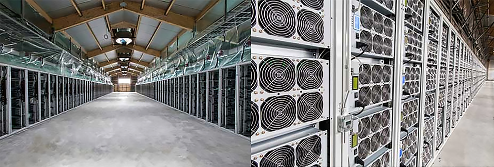
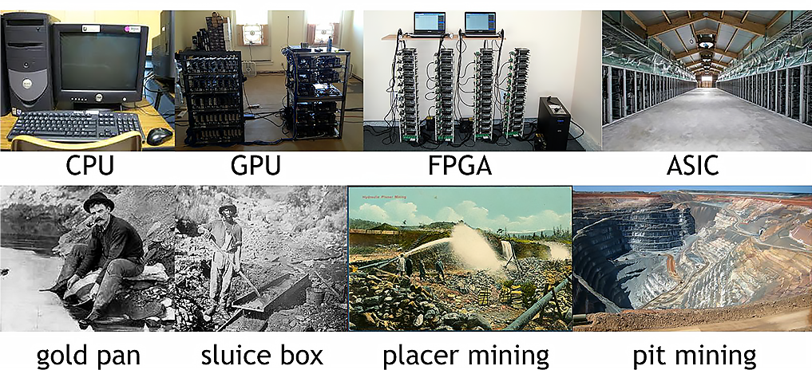

# 6-CONCLUSION

Bitcoin is a new Internet currency that anyone can get started mining. There are a number of reasons you might mine: for profit, to help secure the network, to help found a new Internet currency, or just to gain technical experience.

### **Professional mining**

Today mining has mostly moved away from individuals and toward professional mining centers. Exact details about how these centers operate are not very well known because companies want to protect their setups to maintain a competitive advantage. Presumably, these operations maintain profitability by buying slightly newer and more efficient ASICs than are available for general sale at a bulk discount. Figure below shows a picture of a professional mining center.

Figure 43 - BitFury mining center, a professional mining center in the republic of Georgia

### Mining hardware evolution: Similarities to gold mining

Currently, ASIC mining is the only realistic means to be profitable in Bitcoin and it's not very friendly to small miners. Whereas with Bitcoin mining we\'ve seen an evolution from CPUs to GPUs to FPGAs, to now ASICs, gold mining saw an evolution from individuals with gold pans to small groups of people with sluice boxes, to placer mining[^1] to modern gold mining which often utilizes gigantic open pit mines to extract tons of raw material from the earth (See Figure below).

Figure 44 - Evolution of mining. We can see a clear parallel between the evolution of Bitcoin mining and the evolution of gold mining. Both were initially friendly to individuals and over time became massive operations controlled by large companies.

Both with Bitcoin and with gold, the friendliness and accessibility to individuals has gone down over time and large companies have eventually consolidated most of the operations (and profits).

### A look to the future - The cycle repeats itself

today, there are several smaller Altcoins[^2] have indeed used a different puzzle than SHA-256, but have seen a similar trajectory in mining(hardware) as Bitcoin. recall that for ASICs there is still a long lead time between designing a chip and shipping it, so if a new altcoin uses a new puzzle (even just a modified version of SHA‐256), this will buy some time in which ASICs are not yet available. Typically, mining will proceed just at Bitcoin did from CPUs to GPUs and/or FPGAs to ASICs (if the altcoin will be very successful, like Litecoin[^3]).

Thus, one strategy for smaller miners may be to try to pioneer new altcoins which aren't yet valuable enough for large mining groups to invest in.[^4] in this case, FPGA technology may be the smart choice for development. So, FPGAs may still have a place in the future of cryptocurrency as a platform to test develop new mining algorithms. The biggest advantage of FPGAs in cryptocurrency mining is that they are not limited to one currency such as bitcoin. Other competing cryptocurrencies such as Litecoin could be mined with an FPGA because it could be reprogramed to run Scrypt[^5] instead of SHA-256.

---

By [Mohammad Niknam](https://github.com/MohammadNiknam17)

[^1]: Consisting of large mining groups blasting away hillsides with water

[^2]: *Altcoins are alternatives to the cryptocurrency king, Bitcoin (BTC). These coins differentiate themselves from Bitcoin by extending their capabilities and plugging their shortcomings.*

[^3]: *Litecoin is a peer-to-peer cryptocurrency and open-source software project. it was an early bitcoin spinoff or altcoin, starting in 2011. In technical details, Litecoin is nearly identical to Bitcoin but uses Scrypt as cryptographic algorithm.*

[^4]: *just like small gold miners who have been driven out of proven goldfields might try prospecting unproven new areas. Of course, this means the pioneers are facing a significant risk that the altcoin will never succeed.*

[^5]: *Scrypt -- cryptographic algorithm used in Litecoin (instead of SHA-256 used in btc).*
